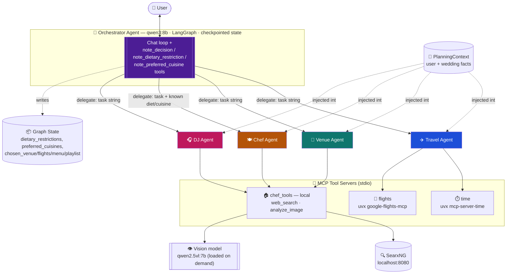

# 💍 Wedding Planner Orchestrator

A multi-agent wedding planner built with **LangChain + LangGraph**, running entirely on **local LLMs via Ollama**. One orchestrator agent chats with you and delegates the actual work — flights, venues, menus, playlists — to specialized sub-agents, each wired up with its own tools over **MCP (Model Context Protocol)**.

No cloud API keys, no per-token bills — just your laptop, Ollama, and a bit of patience for 8B models to think. 🧠

> 🎓 This is a learning project for exploring agent orchestration, tool-calling, and local-first LLM app dev. Not a real wedding planning service — please don't book flights based on it.

---

## 🧠 What's inside

The **orchestrator** owns the conversation and a persisted graph state (dietary restrictions, chosen venue, flights, menu, playlist). It never does the work itself — it routes to a sub-agent tool, then records the decision. Sub-agents are stateless: they get a task + a fixed `PlanningContext` (who's getting married, where, budget, guest count) and hand back an answer.

| Agent                       | Model                                               | Tools                                                                                                                                                              | Job                                                     |
| --------------------------- | --------------------------------------------------- | ------------------------------------------------------------------------------------------------------------------------------------------------------------------ | ------------------------------------------------------- |
| 🧭**Orchestrator**    | `qwen3:8b` (reasoning on)                         | `travel_agent`, `venue_agent`, `chef_agent`, `dj_agent` + `note_dietary_restriction`, `note_preferred_cuisine`, `note_decision`                      | Routes requests to sub-agents, tracks decisions & state |
| ✈️**Travel Agent**  | `qwen3:8b`                                        | 8 flight/time tools (`search_one_way_flights`, `search_round_trip_flights`, `get_travel_dates`, `convert_time`, …) via `flights` + `time` MCP servers | Flight search                                           |
| 🏰**Venue Agent**     | `qwen3:8b`                                        | `web_search` via `chef_tools` MCP → SearxNG                                                                                                                   | Finds & compares venues                                 |
| 🍽️**Chef Agent**    | `qwen3:8b` + `qwen2.5vl:7b` (vision, on-demand) | `web_search`, `analyze_image` via `chef_tools` MCP → SearxNG + vision model                                                                                 | Menu suggestions, cost estimates, food-photo analysis   |
| 🎧**DJ Agent**        | `qwen3:8b`                                        | `web_search` via `chef_tools` MCP → SearxNG                                                                                                                   | Playlist suggestions by genre                           |
| 📝 Summarization middleware | `qwen3:8b`                                        | —                                                                                                                                                                 | Trims the orchestrator's growing message history        |

---

## 🏗️ Architecture



**Flow:** you talk to the orchestrator → it picks a sub-agent tool → the sub-agent calls its MCP tools (web search, flight search, image analysis) → the answer bubbles back up → the orchestrator records the decision into shared state and replies to you, crisply.

---

## 🛠️ Setup Instructions

**Prerequisites**

- Python 3.12+
- [Ollama](https://ollama.com) running locally
- [`uv`](https://docs.astral.sh/uv/) installed (spawns the `time` and `flights` MCP servers via `uvx`)
- A local [SearxNG](https://docs.searxng.org/) instance — see step 1 below for why and how

**1. Start SearxNG (needed for web search)**

The `web_search` tool (used by the venue, chef, and DJ agents to find real venues, songs, and menu ideas) works by querying a local SearxNG instance — it's a self-hosted, privacy-respecting metasearch engine, so the agents can search the web without any search-API key or cloud dependency.

```bash
docker run -d --name searxng -p 8080:8080 \
  -v "$(pwd)/searxng-config:/etc/searxng" \
  searxng/searxng:latest
```

The container writes a default config into `./searxng-config/settings.yml` on first run. Edit that file so JSON output is enabled (required by `tools/web_tools.py`):

```yaml
search:
  formats:
    - html
    - json
```

Then restart it to pick up the change:

```bash
docker restart searxng
```

Verify it's working: `curl "http://localhost:8080/search?q=test&format=json"` should return JSON, not an error.

**2. Pull the local models**

```bash
ollama pull qwen3:8b
ollama pull qwen2.5vl:7b   # only needed for food-photo analysis
```

**3. Create a virtual environment & install dependencies**

Requires **Python 3.12+**, via [`uv`](https://docs.astral.sh/uv/):

```bash
cd fuzzy_waffle
uv venv                        # creates .venv using Python 3.12+
source .venv/bin/activate      # Windows: .venv\Scripts\activate
uv pip install -r requirements.txt
```

---

## ▶️ Run Instructions

Make sure Ollama and SearxNG are running, then:

```bash
uv run orchestrator.py
```

The first run will take a little longer — `uvx` fetches `mcp-server-time` and builds `google-flights-mcp` from GitHub. You'll need internet access for that one-time step (everything else stays local).

Chat away, e.g.:

> We're planning our wedding in Goa on Dec 12 2026 for 120 guests, budget ₹15,00,000. Can you find a beachy venue, flights from Mumbai (BOM), suggest a vegan-friendly South Indian menu with a cost estimate, and a Bollywood/EDM playlist?

Type `exit` or `quit` to end the chat.

---

## 👷 Testing

No automated suite — it's conversational, so testing means chatting. Follow [`test_Steps.md`](test_Steps.md): venue → flights → dietary/cuisine notes → menu → playlist → recap. Check the printed `[state] ...` line each turn — that's ground truth, not the model's prose.

---

## 😄 One for the road

Why did the 8B local model refuse to plan the whole wedding in one message?

*It said it needed to think about it — and then took the next 30 seconds to actually do so.* 🐌🧠

(No models were fired in the making of this project. They're all still happily running on `localhost`.)
